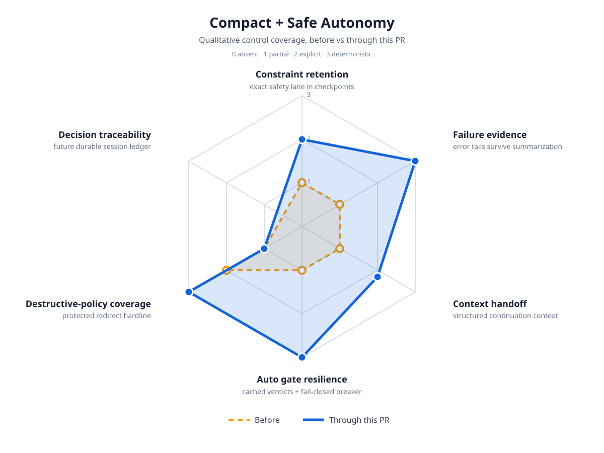

# Compact + Safe Autonomy

This change strengthens two connected faculties without weakening Porcupine's native-first model or its hardline boundaries.

## What changed

| Surface | Before | Through this change |
|---|---|---|
| Compact safety retention | Structured summaries had no dedicated safety section. | Checkpoints explicitly retain user constraints, denied actions, blocked calls, and failures that must not be retried. |
| Error evidence | Large tool output kept only its beginning. The final diagnostic could disappear. | Oversized error results keep a bounded head and tail, so the terminal failure remains visible. |
| Auto-mode latency | Every repeated flagged command could invoke another classifier call. | Exact, model-scoped verdicts are cached briefly. |
| Auto-mode outage handling | A classifier failure denied the one command after waiting up to 25 seconds. | Classification is time-boxed to 8 seconds. Three empty/error responses open a 30-second fail-closed circuit breaker. |
| Protected redirects | Shell writes to protected configuration paths were not a hardline rule. | Direct redirects to system and SSH configuration paths are hardline-blocked. |

## Safety boundaries unchanged

- Native host operation remains the default. Sandboxing is optional.
- Ask still confirms every bash command.
- Normal still confirms flagged commands.
- Auto remains fail-closed for uncertain or unavailable classification.
- Existing hardlines remain monotonic and cannot be relaxed by extensions or configuration.

## Diagram methodology

The radar graphic is a qualitative implementation-coverage map, not a benchmark or performance claim. Each axis uses `0` absent, `1` partial, `2` explicit, and `3` deterministic. "Decision traceability" is deliberately shown as unchanged because durable per-command guard records are follow-up work, not something this change claims to ship.
