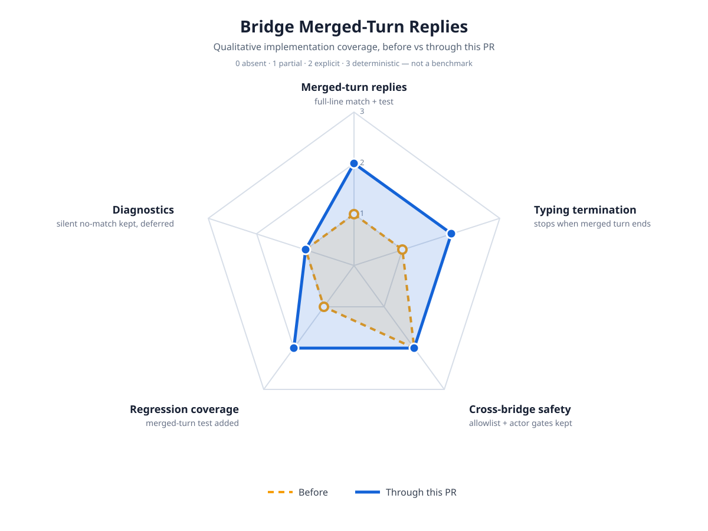

# Bridge Merged-Turn Impact

Qualitative implementation-coverage map for the bridge merged-turn reply fix
(Discord free-text prompts that batch with other queued prompts into one
session turn). This is not a benchmark: scores record what the code
deterministically does, on a 0–3 scale (`0 absent` · `1 partial` ·
`2 explicit` · `3 deterministic`).

## Before / after

| Axis | Before | Through this PR | Evidence |
|---|---|---|---|
| Merged-turn replies | 1 — `textsMatch` accepted exact or middle-wrapped prompts only; a prompt at the first or last line of a batched turn never matched, so the reply was silently dropped | 2 — pending prompt matches when it is any full line of the turn's last user message; shared by all three bridges | `textsMatch`, `test/discord-bridge.test.ts` merged-turn test |
| Typing termination | 1 — typing keepalive stopped only on a matched forward, so dropped turns spun forever | 2 — keepalive stops when the merged turn ends with a reply delivered | merged-turn test asserts the send; `refreshes typing` test still green |
| Cross-bridge safety | 2 — channel + actor allowlists fail-closed on every surface | 2 — unchanged; the matcher only widens *which* turn text counts, never *who* may prompt | allowlist tests in `discord-bridge`, `telegram-bridge`, `imessage-bridge` suites |
| Regression coverage | 1 — provenance test covered exact-match turns only | 2 — new merged-turn test reproduces the reported Discord case; fails before, passes after | `forwards the response when the turn batches several queued prompts` |
| Diagnostics | 1 — genuine no-match drops stay silent | 1 — unchanged and deferred (see below) | — |

## Safety boundaries that did not change

- Attended-only operation: bridges live and die with the interactive session.
- Conversation + actor allowlists stay fail-closed; `!` commands, approvals, and selections keep their message and actor scoping.
- Retry turns (`willRetry`) are still never forwarded.
- Telegram and iMessage forwards use the same matcher and keep their existing tests green (88 tests across the four bridge suites).

## Deferred (visibly unchanged)

- One turn containing several pending entries from the same bridge still forwards once to the first match; the rest stay queued for a later turn.
- No new logging on genuine no-match drops; a diagnostic line is follow-up work, not this PR.
- The reported live case (typing with no reply on an exact single prompt) is explained by turn batching while two surfaces are active at once; an isolated single-prompt turn already matched before this change.

## Scoring methodology

Each increased axis traces to committed code plus a focused test run
(`test/discord-bridge.test.ts`, `test/telegram-bridge.test.ts`,
`test/imessage-bridge.test.ts`, `test/bridge-commands.test.ts`: 88 passed).
Unchanged axes stay at their before values. Values are qualitative
implementation coverage, not performance metrics.
