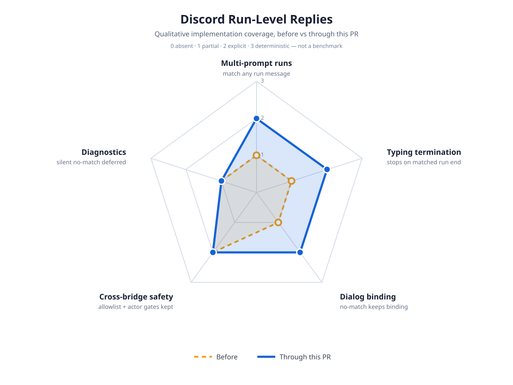

# Discord Run-Level Reply Impact

Qualitative implementation-coverage map for the Discord run-level reply fix
(free-text prompts that share one session run with prompts from other
surfaces). This is not a benchmark: scores record what the code
deterministically does, on a 0–3 scale (`0 absent` · `1 partial` ·
`2 explicit` · `3 deterministic`).

## The actual mechanism (deep audit)

The session drains every queued follow-up inside ONE agent run
(`agent-loop.ts`: `getFollowUpMessages` → one inner loop → one `agent_end`
with the whole run's messages). `handleAgentEnd` matched pending bridge
prompts against the LAST user message only, so any Discord prompt sharing a
run with a later prompt from another surface never matched: the reply was
silently dropped while the typing indicator spun forever. `!status` kept
working because it answers locally without starting a turn. The earlier
`textsMatch` line improvement (#85) covers prompts joined inside one message;
this PR covers prompts that stay separate messages inside one run.

## Before / after

| Axis | Before | Through this PR | Evidence |
|---|---|---|---|
| Multi-prompt runs | 1 — forward matched the last user message only; non-last bridge prompts dropped | 2 — pending entries match against every user message of the run; the reply goes to each distinct matched channel | `userMessageTexts`, `handleAgentEnd`, run-level regression test |
| Typing termination | 1 — keepalive stopped only on a matched forward | 2 — keepalive stops when the run ends with any matched reply | run-level test asserts the send |
| Dialog binding | 1 — any non-matching turn message wiped the active channel binding | 2 — binding changes only on a real match | binding regression test |
| Cross-bridge safety | 2 — channel + actor allowlists fail-closed | 2 — unchanged | allowlist tests still green |
| Diagnostics | 1 — genuine no-match drops stay silent | 1 — unchanged and deferred | — |

## Safety boundaries that did not change

- Attended-only operation: bridges live and die with the interactive session.
- Conversation + actor allowlists, `!` command handling, approval and selection scoping are untouched.
- Retry turns (`willRetry`) are still never forwarded.
- Telegram and iMessage forwards keep their existing behavior and tests (90 tests across the four bridge suites green); they share the same latent pattern and are proposed follow-up, not this PR.

## Deferred (visibly unchanged)

- No new logging on genuine no-match drops.
- Telegram / iMessage run-level matching (same shape, unreported).

## Scoring methodology

Each increased axis traces to committed code plus a focused test run
(`test/discord-bridge.test.ts`, `test/telegram-bridge.test.ts`,
`test/imessage-bridge.test.ts`, `test/bridge-commands.test.ts`: 90 passed).
Unchanged axes stay at their before values. Values are qualitative
implementation coverage, not performance metrics.
