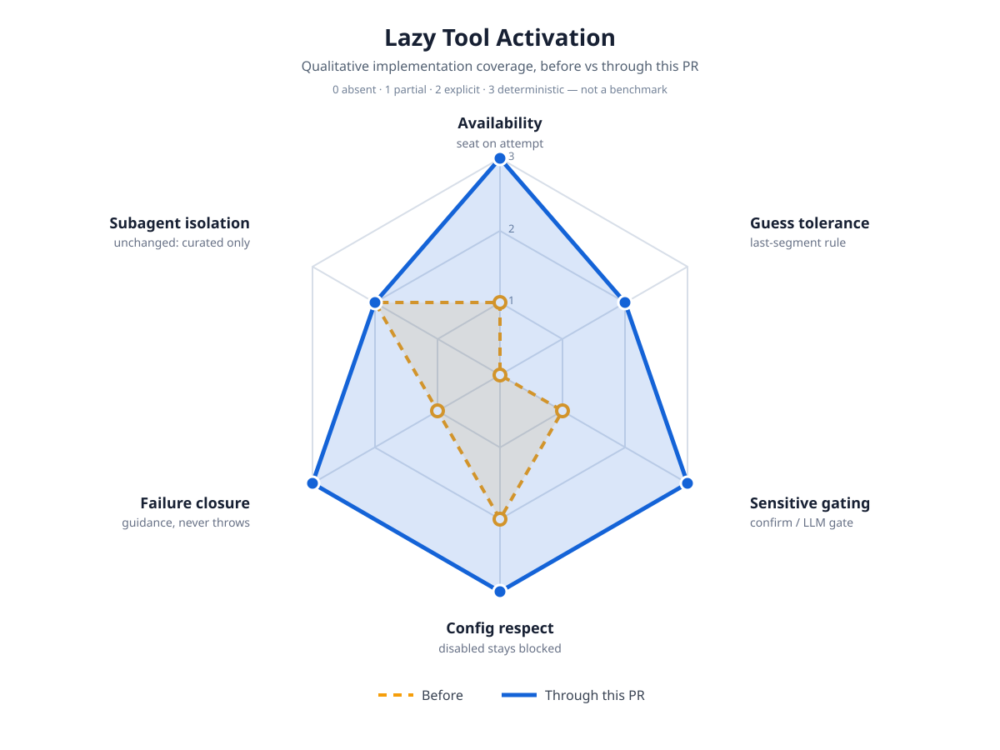

# Lazy Tool Activation Impact

Qualitative implementation-coverage map for seating registered-but-inactive
tools the moment the model tries to call them. This is not a benchmark:
scores record what the code deterministically does, on a 0–3 scale
(`0 absent` · `1 partial` · `2 explicit` · `3 deterministic`).

## Before / after

| Axis | Before | Through this PR | Evidence |
|---|---|---|---|
| Availability | 1 — tools were catalog-visible via `capability_search` but unreachable unless pre-activated | 3 — `resolveUnknownTool` hook seats the tool for this call and future turns, then executes with validated arguments | `agent-loop.ts` hook, `resolveUnknownToolForLoop`, `lazy-unknown-tool.test.ts` |
| Guess tolerance | 0 — any name miss (e.g. `default.plan`) was a plain not-found | 2 — exact match first, then last dot-segment; typos and fuzzy guesses still error so real mistakes stay visible | `resolveLazyToolName`, `lazy-tool-activation.test.ts` |
| Sensitive gating | 1 — unreachable tools needed no gating story | 3 — `computer_use`/`email_send`/`x_post`/`x_reply` require manual confirm in Ask/Normal and the fail-closed LLM gate in Auto | `classifyLazyToolActivation`, `SENSITIVE_LAZY_TOOLS`, tests |
| Config respect | 2 — the registry already filtered allow/exclude lists | 3 — the resolver only draws from the filtered registry, so user-disabled tools can never be seated by a guess; covered by test | `hasTool` wiring, `lazy-tool-activation.test.ts` |
| Failure closure | 1 — every miss produced the same generic message | 3 — specific guidance for denied sensitive tools; resolver throws and aborts fail closed to not-found | `UnknownToolResolution`, throw/abort tests |
| Subagent isolation | 2 — curated tool sets with no recursion | 3 — workers lazily activate only from a fenced pool (agent-level lifecycle + sensitive tier excluded by `SUBAGENT_LAZY_EXCLUDED`); pool calls share the run step budget | `subagentLazyPoolNames`, `runSubagent` `lazyTools`, `subagent-lazy-tools.test.ts` |

## Safety boundaries that did not change

- Ask/Normal/Auto approval semantics; hardline destructive actions stay blocked in every mode.
- Seating a tool grants no permissions by itself — execution still passes through `beforeToolCall`, the bash mode gate, and the plan fence.
- Validation still applies after seating: a guessed call with bad arguments fails normally and the model retries with the real schema.
- Worker lazy calls share the run's step budget and never reach agent-level or sensitive tools; the pool is built from the session registry minus the exclusion set.
- Cron stays attended-only; memory hygiene untouched.

## Deferred

- Auto-deseating idle tools to hold context flat (activation only in this PR).
- Surfacing the seating moment in the TUI (a first-use chip) — currently visible only in tool rows and session receipts.
