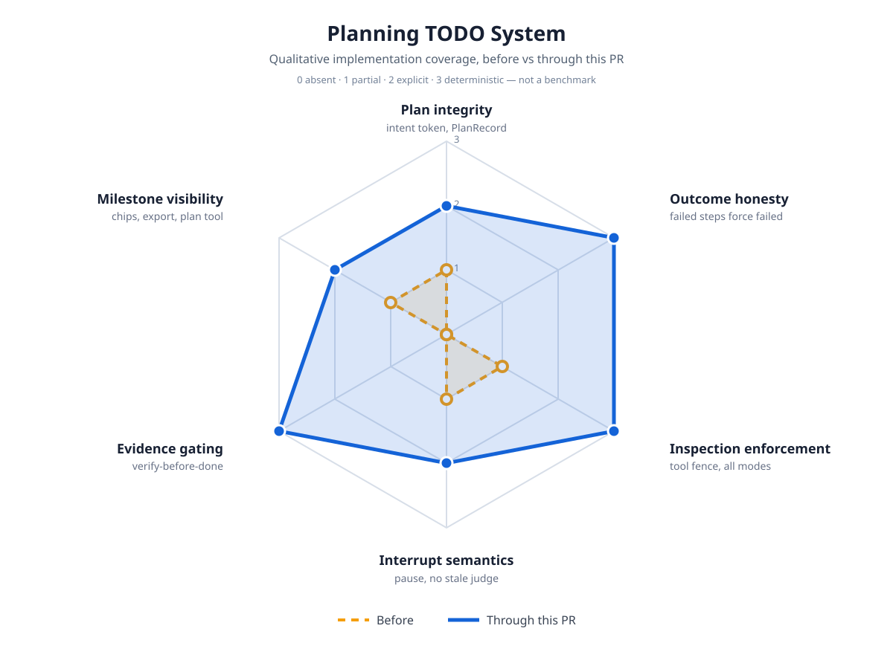

# Planning TODO Impact

Qualitative implementation-coverage map for the autonomous planning/TODO
system: plan-turn lifecycle fixes, the evidence-gated `plan` tool, the
inspection-only fence, and plan status chips. This is not a benchmark:
scores record what the code deterministically does, on a 0–3 scale
(`0 absent` · `1 partial` · `2 explicit` · `3 deterministic`).

## Before / after

| Axis | Before | Through this PR | Evidence |
|---|---|---|---|
| Plan integrity | 1 — `SavedPlan` metadata existed, but the projection dropped dependencies/artifacts/verification and `/plan` graphs fell into the ordinary-turn reset | 2 — explicit plan-turn token preserves the graph; `PlanRecord` keeps full typed data with cycle/dependency validation | `shouldPreservePlanGraphForTurn`, `plan-record.ts`, `plan-turn-intent.test.ts`, `plan-record.test.ts` |
| Outcome honesty | 0 — every `agent_end` marked the graph `done` unconditionally | 3 — failed steps and retries force a failed turn outcome; the helper itself refuses done-over-failure | `hasFailedSteps`, `markTurnComplete`, `plan-turn-intent.test.ts` |
| Inspection enforcement | 1 — `/plan` non-mutation lived in prompt text only | 3 — turn-scoped tool fence in `beforeToolCall` (edits, writes, delegation, mutating bash denied) across Ask/Normal/Auto | `plan-fence.ts`, `setPlanFenceActive`, `plan-fence.test.ts` |
| Interrupt semantics | 1 — aborts re-entered goal judging on stale text and re-queued work | 2 — interrupts pause goals and skip plan saves with distinct warnings; full TUI abort paths covered at helper level, not end-to-end | `lastTurnInterrupted`, `classifyPlanSettle`, `filterOutGoalPlanQueue`, `plan-turn-intent.test.ts` |
| Evidence gating | 0 — tool success stood in for completion | 3 — start/verify/complete transitions with evidence refs; direct completion rejected; `file-exists:` predicates | `plan-record.ts` transitions, `plan.ts` tool, `plan-record.test.ts`, `plan-tool.test.ts` |
| Milestone visibility | 1 — tool-activity graph only | 2 — per-action chips naming the agent-written todo, record-driven status/export views; footer milestone graph deferred | `animations.ts` plan ids, `planEndBeat`, `formatPlanRecordMarkdown`, `activity-task-progress.test.ts` |

## Safety boundaries that did not change

- Ask/Normal/Auto approval semantics; hardline destructive actions stay blocked in every mode.
- The plan tool mutates plan state only; it grants no filesystem, shell, delegation, publish, or delete rights.
- Cron stays attended-only; task-store atomic claims and `unknown` recovery untouched.
- Sub-agent budgets, permission policy, and WoT messaging untouched.
- The fence removes rights during draft turns; it never widens them.

## Deferred

- Footer task graph showing milestone data (mapping helper `planStepToGraphStatus` exists and is tested).
- Plan summary injection into compaction/branch prompts (`projectPlanRecordSummary` exists and is tested).
- Bridging `/plan` prose artifacts into structured records.
- Persistent todo-list widget (list renders in tool result rows instead).
- Plan-tool state persists per tool instance; session-entry persistence is future work.
