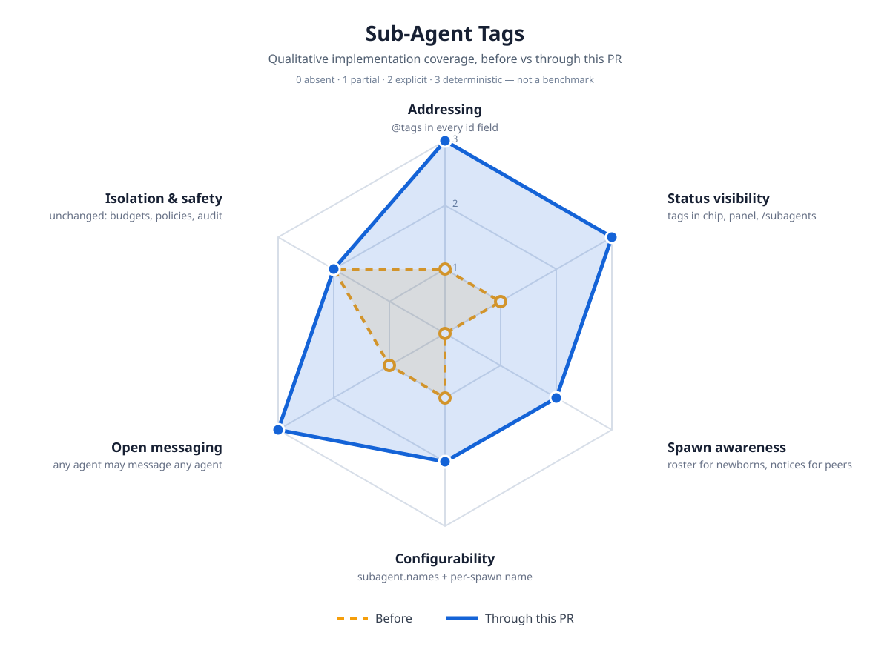

# Sub-Agent Tags Impact

Qualitative implementation-coverage map for named sub-agents (`@porcupine`,
`@buck`, `@fudgy`, `@tinker`) with open addressing. This is not a benchmark:
scores record what the code deterministically does, on a 0–3 scale
(`0 absent` · `1 partial` · `2 explicit` · `3 deterministic`).

## Before / after

| Axis | Before | Through this PR | Evidence |
|---|---|---|---|
| Addressing | 1 — raw `sa-…` ids in every field | 3 — `@tag`, name, or id accepted in `send_to_subagent`, `stop_subagent`, WoT `send_message`, with live-tag errors | `subagent-names.ts`, tool tests |
| Status visibility | 1 — truncated ids, no live roster | 3 — tags in the footer chip, `/subagents` live section (`Live (n/3)`), spawn ack, report lines | panel formatter + tests, chip tests |
| Spawn awareness | 0 — newborns start blind, peers never told | 2 — spawn roster in the brief; best-effort peer-online notices (a peer that cannot be steered misses it) | `buildSpawnRoster` + tests |
| Configurability | 1 — `maxConcurrent` only | 2 — plus `subagent.names` override and per-spawn `name`, sanitized with defaults backfill | settings tests |
| Open messaging | 1 — same-group gate | 3 — any running agent may address any other; bus audit retained | bus tests |
| Isolation & safety | 2 — budgets, policies, no-recursion | 2 — unchanged: same budgets, permission policy, no-questions, no-recursion, full audit trail | No safety code touched |

## Safety boundaries that did not change

- Attended-only workers with the parent's cwd, permission policy, and safety gates.
- Step/context budgets, fail-closed approvals, no sub-agent recursion, no user questions.
- Every routed message stays audited on the bus; `@main` remains accepted alongside `@porcupine`.

## Deferred

- Persisted past sessions keep id-based headers (live runs carry the tags).
- iMessage-style per-channel presence for agents was not proposed.
