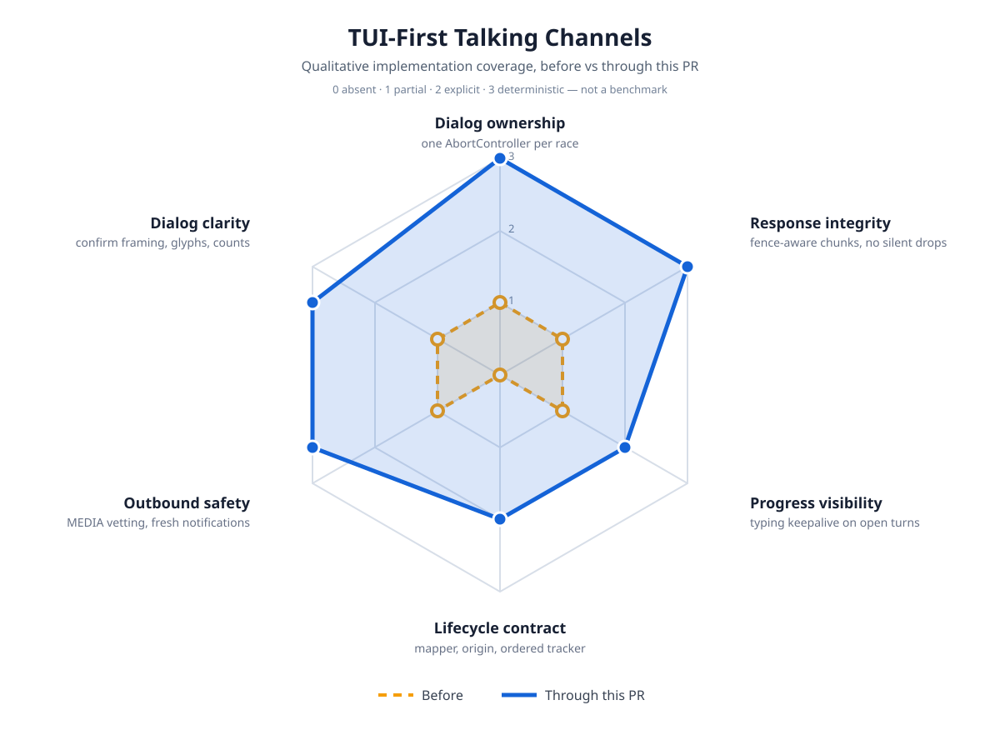

# Talking Channels Impact

Qualitative implementation-coverage map for the TUI-first talking-channels
change (Telegram / Discord / iMessage as adapters of the terminal session).
This is not a benchmark: scores record what the code deterministically does,
on a 0–3 scale (`0 absent` · `1 partial` · `2 explicit` · `3 deterministic`).

## Before / after

| Axis | Before | Through this PR | Evidence |
|---|---|---|---|
| Dialog ownership | 1 — `Promise.race` with no loser cleanup; losers lived until 5–10 min timeouts | 3 — `DialogCoordinator` owns one AbortController per race; winner aborts every loser | `dialog-coordinator.ts`, `raceConfirmation`, `test/dialog-coordinator.test.ts`, per-bridge abort tests |
| Response integrity | 1 — fixed slicing tore code fences; attachments dropped silently | 3 — `splitMessage` keeps chunks within limits with fences intact; captions prompt; attachment-only messages answered | `splitMessage`, `test/telegram-bridge.test.ts` chunk/attachment suites |
| Progress visibility | 1 — one typing ping per prompt; long turns looked dead | 2 — typing keepalive refreshes open turns on Telegram/Discord; iMessage has no typing surface | keepalive timers, `typing keepalive` tests |
| Lifecycle contract | 0 — ad-hoc per-bridge provenance | 2 — shared states, pure session-event mapper, origin resolution, ordered tracker; adapters consume it in follow-ups | `conversation-lifecycle.ts`, `test/conversation-lifecycle.test.ts` |
| Outbound safety | 1 — `MEDIA:` read any absolute path; background pushes never expired | 3 — workspace/temp + 20 MB vetting with refusals; send-failure fallbacks; 30-minute notify window | `resolveShareableMediaPath`, freshness tests |
| Dialog clarity | 1 — confirmations identical to pickers; input placeholder dropped | 3 — confirm framing, placeholder + `❯`, tool glyphs, `Failed` chip, `Queued (N)` | `test/extension-dialogs.test.ts`, glyph and label tests |

## Safety boundaries that did not change

- Attended-only operation: bridges live and die with the interactive session.
- Conversation + actor allowlists stay fail-closed on every surface.
- Ask/Normal/Auto approval semantics are unchanged; the coordinator only settles *how* a decision travels, never *who* may decide.
- The 272k long-context pricing tier behavior is untouched.

## Deferred (visibly unchanged)

- iMessage poll stagger/backoff (macOS-only, no test harness).
- Discord injectable fetch (larger refactor; tests swap the global fetch).
- `[instructions]` / `[skill]` prompt-tag audit (separate deferred plan).
