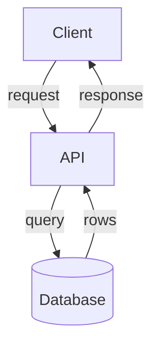

# Output Formats — Mermaid vs SVG, syntax and verification

## When to use each

**Mermaid** (default): GitHub README, markdown docs, anything reviewable as
text, quick iteration, and diagrams whose structure is the point.

**SVG** (escalate): custom layout Mermaid can't express (quadrants, precise
placement, brand/hero graphics), or when the diagram ships as a standalone
image for a launch post or slide.

## Mermaid

Wrap in a fenced block with the language:

````markdown

````

Key syntax (the 80%):

- Flowchart: `flowchart TD` (top-down) or `LR`. Nodes `A[label]`, decision
  `A{label}`, database `A[(label)]`, subgraph `subgraph name ... end`.
- Sequence: `sequenceDiagram`, `participant A`, `A->>B: message`, `alt/else/end`,
  `Note over A: text`.
- State: `stateDiagram-v2`, `[*] --> State`, `State --> [*]`, `state State { ... }`.
- ER: `erDiagram`, `ENTITY { type field }`, `ENTITY ||--o{ OTHER : label`.
- Gantt: `gantt`, `section Name`, `Task :start, duration`.
- Pie: `pie`, `"Label" : value`.

Gotchas:
- Node ids must be unique even if labels repeat.
- `-->|text|` is an edge with a label; use it, unlabeled edges are ambiguous.
- GitHub renders Mermaid in README/issues, but NOT inside tables or collapsed
  sections reliably — put the block at top level.

## SVG (standalone, self-contained)

Rules for hand-written SVG:

- `<svg viewBox="0 0 W H" xmlns="...">` — never omit `viewBox`, it's what makes
  it scale.
- Set `font-family="system-ui, -apple-system, sans-serif"` once on the root.
- Use `fill`, `stroke`, `stroke-width` from the style-guide tokens.
- `<text>` needs a `fill` explicitly (inheritance is unreliable across viewers).
- No external resources (fonts, images). Self-contained only — it must render
  from the single file.
- Give it a `role="img"` and an `<title>` (or `<desc>`) for accessibility.

## Verification checklist (run before calling it done)

1. Every node/entity is reachable — no orphan boxes.
2. Every node and edge is labeled (or covered by a legend).
3. Contrast passes 4.5:1 on all text (see style-guide).
4. One flow direction throughout.
5. For Mermaid: paste-verify it renders in a Mermaid renderer (or at minimum
   re-read the syntax for the gotchas above).
6. For SVG: it opens in a browser, fits one screen, no missing fonts/images.
