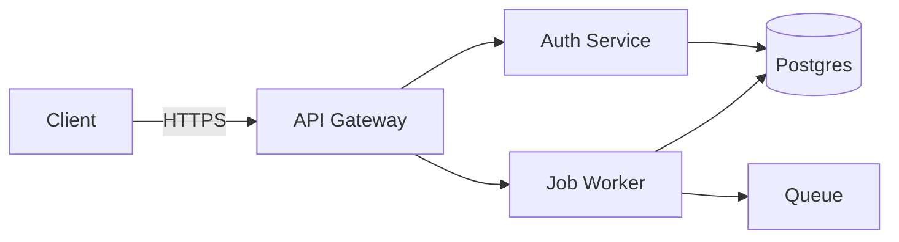
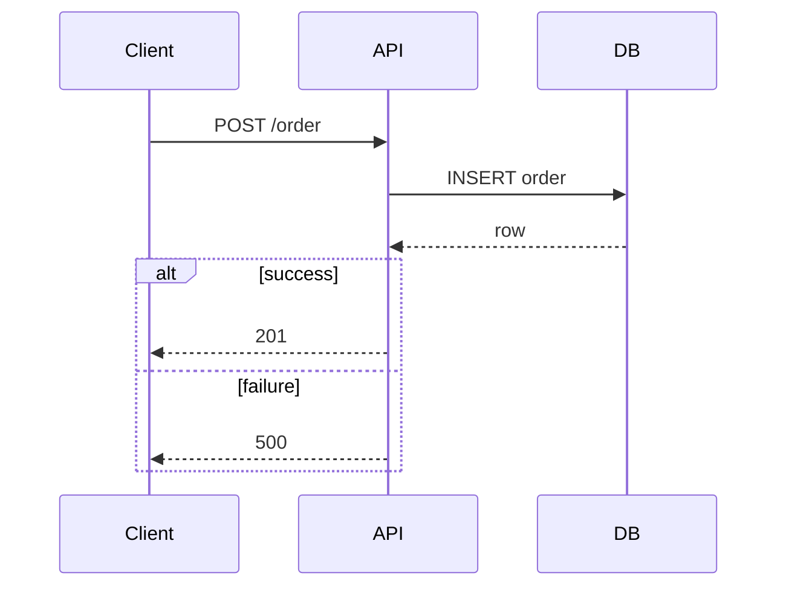
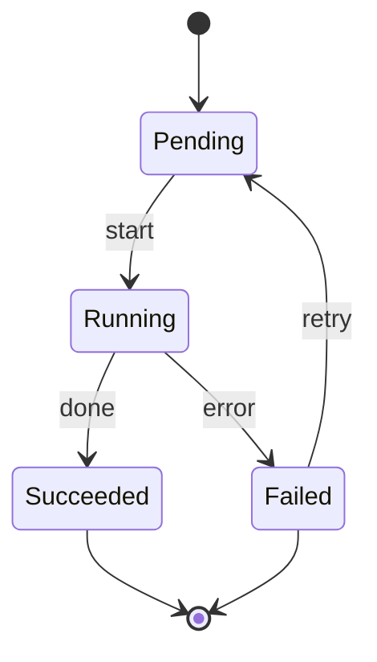
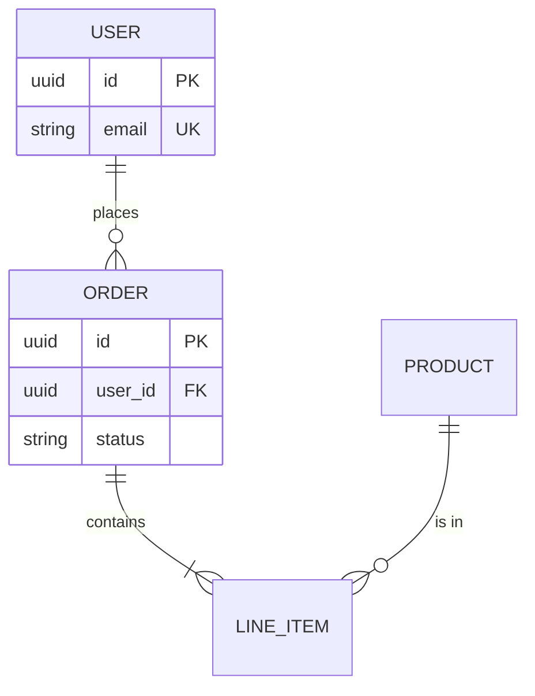
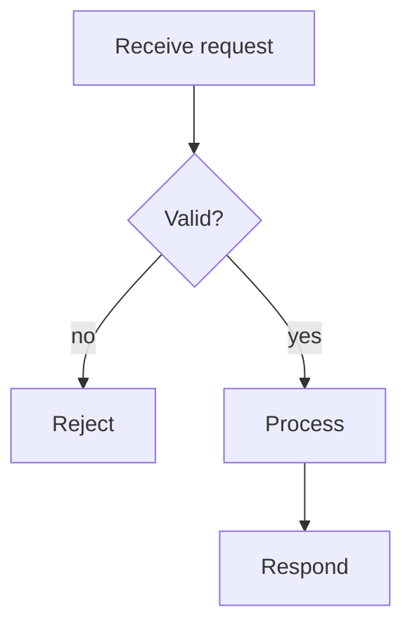
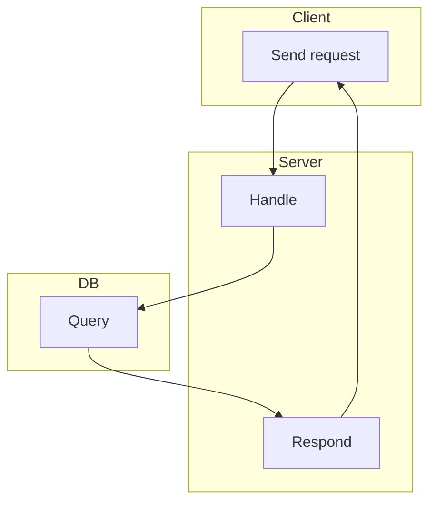
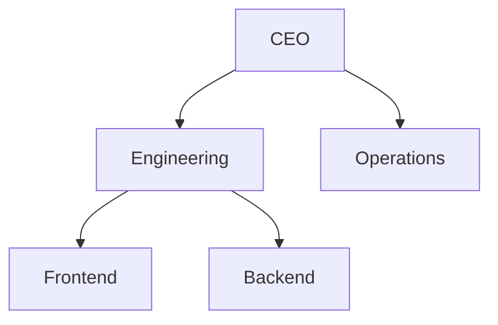
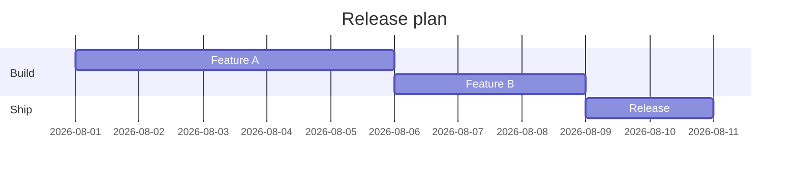
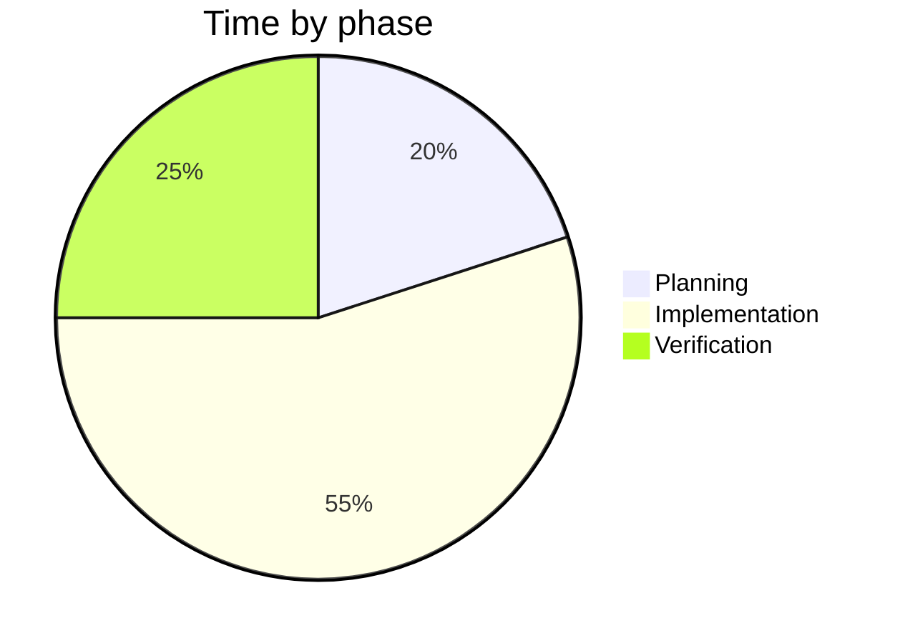

# Type Guide — which diagram, and a worked example for each

The type answers the *question*. Worked Mermaid examples below; adapt labels to
your domain and apply the style-guide tokens.

## Architecture / component (`flowchart`)

Question: "What are the parts and how do they connect?"

Notes: put external services in `danger`/`warn` tone, internal in `accent`.
Label every edge with the protocol/action.

## Sequence (`sequenceDiagram`)

Question: "What happens, in order, between actors?"

Notes: use `alt/else` for branches, `Note over X` for caveats. Keep the happy
path first, branches second.

## State machine (`stateDiagram-v2`)

Question: "What states exist and what moves between them?"

Notes: every state needs an entry and an exit; terminal states point to `[*]`.

## ER / data model (`erDiagram`)

Question: "How do entities relate?"

Notes: mark PK/FK/UK. Crow's-foot: `||` one, `o{` zero-or-many, `|{` one-or-many.

## Flowchart / process (`flowchart`)

Question: "What are the steps and decisions?"

Notes: decisions are diamonds `{}`, actions are rectangles. One entry, clear
terminal.

## Swimlane (`flowchart` + subgraphs)

Question: "Who does what, in parallel lanes?"

## Org chart / hierarchy (`flowchart` tree)

Question: "Who reports to whom?"

## Gantt / timeline (`gantt`)

Question: "What is the schedule?"

## Bar / line / pie (`pie` or SVG)

Question: "How do quantities compare?" — `pie` for part-of-whole, SVG for
bar/line (Mermaid's chart types are limited; hand-write SVG for anything
axis-based).

## Quadrant (2x2) — SVG only

Mermaid can't express a 2x2 positioning chart. Hand-write SVG: a square divided
into 4, axes labeled (effort vs impact, etc.), items placed by their
coordinates, color-coded by quadrant.
