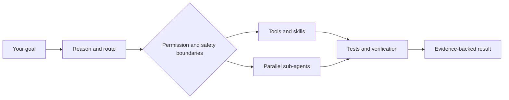

<p align="center">
  
</p>

<p align="center">
  <a href="https://github.com/Abd0r/porcupineai/actions/workflows/ci.yml"></a>
  <a href="https://www.npmjs.com/package/@porcupineai/porcupineai"></a>
  <a href="https://www.npmjs.com/package/@porcupineai/porcupineai"></a>
  <a href="LICENSE"></a>
  <a href="https://github.com/Abd0r/porcupineai"></a>
</p>

<h3 align="center">The open-source terminal AI agent built for safe autonomy.</h3>

<p align="center">
  Give Porcupine a goal. It reasons, routes capabilities, uses tools, delegates work, verifies the result, and keeps risky action inside the permission boundary you control.
</p>

<p align="center">
  <a href="#start-in-60-seconds"><strong>Get started</strong></a> ·
  <a href="#why-porcupine">Why Porcupine</a> ·
  <a href="#what-it-can-do">Capabilities</a> ·
  <a href="#evaluation">Evaluation</a> ·
  <a href="#safety-boundaries">Safety</a> ·
  <a href="#documentation">Documentation</a>
</p>

<p align="center">
  Built on top of <a href="https://github.com/earendil-works/pi">Pi</a> (MIT).
</p>

---

## Why Porcupine

Porcupine does not treat autonomy as all-or-nothing. You choose how much it may do before asking.

| | Porcupine |
|---|---|
| **Safe autonomy** | Ask, Normal, and Auto modes let you choose the permission boundary. Normal asks on flagged actions; Auto applies a fail-closed safety gate. Hardline destructive actions remain blocked. |
| **End-to-end work** | Porcupine reads the real project, chooses tools and skills, edits files, runs checks, recovers from failures, and reports evidence instead of stopping at a plausible answer. |
| **Native-first** | It works on your computer with your tools and files by default. Gondolin, Docker, and OpenShell isolation remain opt-in when you want a stronger boundary. |
| **Parallel execution** | Context-isolated sub-agents can research, inspect, implement, and review in parallel. Web of Thoughts lets them coordinate live. |
| **One session, more surfaces** | Continue the same attended session from the terminal, Telegram, Discord, or iMessage. Use headless and server modes for scripts, CI, IDEs, and clients. |
| **Open capability system** | Tools and skills live in 18 capability stacks. Extend Porcupine through Agent Skills, MCP, TypeScript extensions, packages, prompts, themes, and custom providers. |

## Start in 60 seconds

Requires **Node.js 22.19+**.

```bash
npm install -g @porcupineai/porcupineai
porcupine
```

Then connect a provider inside the TUI:

```text
/login cline
/model
/guide
```

Cline provides a free API route. Select `cline/deepseek/deepseek-v4-flash` from `/model`, or connect another supported provider with `/login`.

Give it a real goal:

```text
Review this repository, explain how it works, run its checks, and make the safest high-impact improvement you can verify.
```

Porcupine decides whether the turn needs a direct answer, tools, a skill, a plan, or parallel workers. It continues until the requested result is real or a genuine decision requires you.

<details>
<summary><strong>Build from source</strong></summary>

```bash
git clone https://github.com/Abd0r/porcupineai.git
cd porcupineai/Porcupine
npm install --ignore-scripts
npm run build
npm link
```

</details>

## How work flows



The model leads the work. The harness supplies the capability tree, permission boundary, durable state, recovery paths, and verification loop.

## Choose the autonomy level

| Mode | Behavior | Best for |
|---|---|---|
| **Ask** | Confirms every shell command and file mutation | Unfamiliar repositories and maximum oversight |
| **Normal** | Runs safe operations and asks on flagged actions | Everyday interactive work |
| **Auto** | Works autonomously while flagged shell actions pass through a fail-closed safety gate | Longer goals in trusted projects |

Reasoning depth is separate from permission. `/reasoning` and `/adaptive` change thinking effort; `/modes` changes what Porcupine may do without asking.

Auto is not unrestricted. Hardline destructive actions remain blocked in every mode.

## What it can do

| Faculty | Capabilities |
|---|---|
| **Build and maintain** | Read and edit repositories, run shell commands, debug failures, use Git, build, test, review, and document changes. |
| **Develop for the web** | Frontend and backend workflows, accessibility, responsive design, APIs, authentication, migrations, observability, browser QA, performance, SEO, and deployment readiness. |
| **Research** | Free web-search cascade, page extraction, Reddit and arXiv search, evidence grading, durable literature tracking, and parallel deep research. |
| **Use the web and computer** | Playwright browser tools, semantic snapshots, screenshots, responsive checks, diagnostics, and confirmation-gated native desktop interaction. |
| **Coordinate** | Up to three parallel sub-agents by default, fresh context windows, hard step budgets, live progress, instant reports, steering, cancellation, and WoT peer messaging. |
| **Remember and continue** | Durable sessions, branching, compaction, memory, reusable project workspaces, and cross-session history search. |
| **Automate attended work** | Durable tasks, success and failure chains, file and script triggers, and UTC Cron schedules while the interactive session is open and idle. |
| **Communicate** | Telegram, Discord, and iMessage bridges; email over IMAP/SMTP; free X search and reading; local drafts and compose-then-paste posting. |
| **Integrate** | MCP tools, resources and prompts; `porcupine serve`; JSONL and RPC modes; a Node.js SDK; custom tools and providers. |
| **Observe** | Per-turn usage, cost estimates, session evidence, task history, browser diagnostics, sub-agent activity, and a full-screen Markdown viewer. |

## Parallel work without losing the thread

Porcupine can delegate self-contained work to background sub-agents. Each worker receives:

- a fresh context window;
- the whole tool stack minus agent-level tools, user questions, and native computer control;
- a hard step budget, 120 by default;
- the same working directory and permission policy;
- instant report injection when the worker finishes.

Give workers the same `peerGroup` to enable **Web of Thoughts**. They can exchange findings live while the main agent remains the gatekeeper. The main agent can steer a worker with `send_to_subagent` or stop it when it goes off track.

See [Sub-agents](Porcupine/packages/coding-agent/docs/subagents.md).

## One agent, more than one surface

| Surface | Use |
|---|---|
| **Terminal TUI** | The full interactive experience, including permission dialogs, session tree, Markdown viewer, usage, cost, and live activity. |
| **Telegram, Discord, iMessage** | Message the same attended session from another device. Chat/channel and sender allowlists protect prompts and approvals; valid confirmation buttons and reactions race the TUI. |
| **HTTP server** | `porcupine serve` exposes sessions, asynchronous prompts, SSE events, and programmatic approval for IDEs and clients. |
| **Headless mode** | `porcupine --headless "task"` runs a CI-friendly task and exits `0` on success or `1` on failure or abort. |
| **RPC and JSONL** | Embed Porcupine in scripts and applications through structured process protocols. |

Remote bridges are conversation-and-sender allowlist-gated and attended. They drive the shared session; they are not unattended daemons.

## Extensible by design

| Extension point | What it adds |
|---|---|
| **Stacks** | One discoverable hierarchy for filesystem, shell, web, web development, VCS, build, debugging, safety, data, ML, research, computer use, and orchestration capabilities. |
| **Agent Skills** | On-demand procedures in portable `SKILL.md` packages. Porcupine can extract skills from documents or craft them from research. |
| **MCP** | Connect stdio and Streamable HTTP servers. Their tools, resources, and prompts become first-class capabilities. |
| **TypeScript extensions** | Add tools, commands, event handlers, UI, providers, and lifecycle behavior. |
| **Packages** | Bundle and share extensions, skills, prompts, and themes. |
| **SDK and protocols** | Embed the agent loop through the Node.js SDK, RPC, JSONL, or the HTTP server. |

Explore the [18-stack capability tree](Porcupine/packages/coding-agent/docs/stacks.md), [skills](Porcupine/packages/coding-agent/docs/skills.md), [MCP](Porcupine/packages/coding-agent/docs/mcp.md), and [extensions](Porcupine/packages/coding-agent/docs/extensions.md).

## Providers

Porcupine separates the agent from the model route. Use a free path, a subscription, your own API key, or a local router.

| Route | Setup |
|---|---|
| **Cline API** | Create a free key at [app.cline.bot](https://app.cline.bot), run `/login cline`, then choose `cline/deepseek/deepseek-v4-flash` from `/model`. |
| **OpenCode Go** | Run `/login opencode-go`, then choose an available model and reasoning level from `/model`. |
| **Built-in providers** | Connect supported API-key and subscription providers with `/login` or provider environment variables. |
| **Local models** | Route supported local models through llama.cpp. |

See [Providers](Porcupine/packages/coding-agent/docs/providers.md) and [llama.cpp](Porcupine/packages/coding-agent/docs/llama-cpp.md).

## Evaluation

Porcupine publishes its harness results with methodology, raw records, failures, and caveats.

| Suite | Porcupine result | Evidence |
|---|---:|---|
| **Aider Polyglot** | **194/225, 86.2%** | Six languages, hidden tests restored after the agent run. [Methodology and raw results](benchmarks/polyglot/README.md). |
| **Terminal-Bench 2.1** | **45 clean passes** | 45/54 cleanly scored tasks passed; 35 of 89 tasks remained unscored after benchmark-rig failures. [Scoring and raw results](benchmarks/tbench/README.md). |

Both runs used DeepSeek V4 Flash through the Porcupine harness. These results measure the exact model and harness combination, not every model, provider, workload, or commercial agent.

## Safety boundaries

Porcupine is native-first. By default, it runs with the permissions of the account that launches it.

- **Project trust is not a sandbox.** It controls project-local resource loading, not operating-system permissions.
- **Interaction modes are the autonomy dial.** Ask, Normal, and Auto control approvals; reasoning settings do not grant permission.
- **Auto fails closed on flagged shell actions.** Hardline destructive actions remain blocked in every mode.
- **Native computer input is confirmation-gated.** The workflow starts with observation, treats screen text as untrusted, takes one approved action, then verifies the visible result.
- **Isolation is optional.** `/sandbox on` routes built-in tools into a Gondolin micro-VM. Docker and OpenShell workflows are also documented.
- **Extensions and skills are trusted code and instructions.** Review them before loading them, and use trusted repositories.

Read [Security](Porcupine/packages/coding-agent/docs/security.md) and [Containerization](Porcupine/packages/coding-agent/docs/containerization.md) before using Porcupine on untrusted work.

## Documentation

| Start | Operate | Extend | Integrate |
|---|---|---|---|
| [Quickstart](Porcupine/packages/coding-agent/docs/quickstart.md) | [Usage](Porcupine/packages/coding-agent/docs/usage.md) | [Stacks](Porcupine/packages/coding-agent/docs/stacks.md) | [MCP](Porcupine/packages/coding-agent/docs/mcp.md) |
| [Providers](Porcupine/packages/coding-agent/docs/providers.md) | [Sessions](Porcupine/packages/coding-agent/docs/sessions.md) | [Skills](Porcupine/packages/coding-agent/docs/skills.md) | [Server API](Porcupine/packages/coding-agent/docs/server.md) |
| [Web Development](Porcupine/packages/coding-agent/docs/web-development.md) | [Settings](Porcupine/packages/coding-agent/docs/settings.md) | [Extensions](Porcupine/packages/coding-agent/docs/extensions.md) | [SDK](Porcupine/packages/coding-agent/docs/sdk.md) |
| [Browser use](Porcupine/packages/coding-agent/docs/browser.md) | [Tasks and Cron](Porcupine/packages/coding-agent/docs/usage.md#tasks-and-cron-routines) | [Prompt templates](Porcupine/packages/coding-agent/docs/prompt-templates.md) | [RPC](Porcupine/packages/coding-agent/docs/rpc.md) |
| [Sub-agents](Porcupine/packages/coding-agent/docs/subagents.md) | [Messaging bridges](Porcupine/packages/coding-agent/docs/messaging.md) and [environment variables](Porcupine/packages/coding-agent/docs/environment-variables.md) | [Themes](Porcupine/packages/coding-agent/docs/themes.md) | [JSON event stream](Porcupine/packages/coding-agent/docs/json.md) |
| [Full documentation index](Porcupine/packages/coding-agent/docs/index.md) | [Keybindings](Porcupine/packages/coding-agent/docs/keybindings.md) | [Custom providers](Porcupine/packages/coding-agent/docs/custom-provider.md) | [Email](Porcupine/packages/coding-agent/docs/email.md) and [X](Porcupine/packages/coding-agent/docs/x.md) |

## Contributing

Contributions are welcome. Keep changes focused, test behavior changes, and update documentation when the user-facing contract moves.

- Read [CONTRIBUTING.md](CONTRIBUTING.md).
- Browse or open [issues](https://github.com/Abd0r/porcupineai/issues).
- Report security problems according to [SECURITY.md](SECURITY.md). Never include credentials in a report.

## License and foundation

Porcupine is released under the [MIT License](LICENSE).

Built on top of [Pi](https://github.com/earendil-works/pi) (MIT).

---

<p align="center">
  <strong>If Porcupine helps you do real work, a <a href="https://github.com/Abd0r/porcupineai">GitHub star</a> helps more people find it.</strong>
</p>

<p align="center">
  <a href="https://github.com/Abd0r/porcupineai">GitHub</a> ·
  <a href="https://www.npmjs.com/package/@porcupineai/porcupineai">npm</a> ·
  <a href="https://github.com/Abd0r/porcupineai/releases">Releases</a> ·
  <a href="LICENSE">MIT License</a>
</p>

<p align="center">
  Follow development on X: <a href="https://x.com/SyedAbdurR2hman">@SyedAbdurR2hman</a>
</p>
